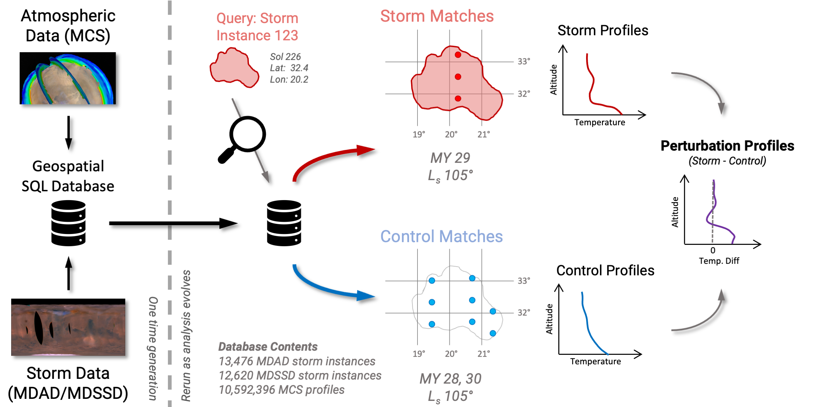

# MERCAP
Mars Examination foR ClimAte Patterns

This analysis uses Mars Climate Sounder observations and known dust storm locations from the Mars Dust Storm Sequence Dataset (MDSSD) and Mars Dust Activity Database (MDAD).

# Overview

MERCAP harmonizes atmospheric observations from MCS with MDSSD/MDAD using geospatially-enabled databases. This framework enables targeted extraction and analysis of atmospheric data (dust opacity, temperature, and surface temperature) associated with specific dust storm instances. After extracting coincident atmospheric measurements, we can use that data to study of how local and regional dust storms impact the Martian atmosphere and surface.

Further, we can use "control" measurements from the same location and season (but not intersecting any known storms) to estimate how much any given storm event perturbed the atmosphere.



# Installation

## Dependencies
Install the mcs_tools package:
```
git clone https://github.com/cloudspotting-on-mars/mcstools
cd mcstools
pip install -e .
```

## Install mercap
`pip install -e .`

# Usage

## Database Setup

To do the storm matching, you'll need to run a PostgreSQL database with the [PostGIS](https://postgis.net/) extension enabled. PostGIS adds geospatial-based querying support, which this code relies on to efficiently match MCS atmospheric profiles against storm polygons.

## Process/Ingest MCS Data

`mercap/utils/transcribe_mcs_to_db.py` reads a tab-separated MCS DDR1 data dump, augments each profile with Mars year and sol columns (via `mars_time`), converts profile coordinates to PostGIS geometry, and writes the result to a PostGIS database table. After insertion, the script creates a bunch of indices on to speed up downstream spatial queries.

```
python mercap/utils/transcribe_mcs_to_db.py \
--mcs_fpath '/path/to/mcs_ddr1_dump.txt' \
--db_url 'postgresql://<path_to_geospatial_db>' \
--table_name 'mcs_profiles_2d' \
--mcs_ddr1_latlon Surf \
--write_conflict_behavior 'replace'
```

Use `--mcs_ddr1_latlon` to select which DDR1 coordinate pair (`Profile` or `Surf`) defines each profile's location. 

## Process/Ingest MDSSD Data

`mercap/parse_mdssd.py` reads MDSSD storm files, converts binary storm masks to geospatial polygons, augments each storm with timing and geometry metadata, and writes the result to a CSV and/or a PostGIS database. The `--smoke_test` flag is helpful here to run quick sanity checks.

```
python mercap/parse_mdssd.py \
--mdssd_head_dir '/path/to/mdssd' \
--csv_output_fpath '/path/to/mdssd_processed.csv' \
--marci_lists_dir '/path/to/marci_lists' \
--marci_cumindex_fpath '/path/to/CUMINDEX.TAB' \
--db_url 'postgresql://<path_to_geospatial_db>' \
--n_jobs 8
```

If `IMPROVE_MARCI_TIMING_PRECISION` is enabled in `config.py` (default `True`), provide `--marci_lists_dir` and `--marci_cumindex_fpath` to substitute more precise swath-level Ls and datetime values from the MARCI cumulative index. That information can be obtained from the PDS.

## Process/Ingest MDAD Data

`mercap/parse_mdad_v3.py` performs the equivalent processing for MDAD data. We use the version of MDAD which stores per-sol storm masks in NetCDF files (one file per Mars year), so the script additionally requires the path to the MDAD master CSV (`--mdad_csv_fpath`) that maps mask values to storm metadata. There are also CSV versions of the data available, but we don't parse that version.

```
python mercap/parse_mdad_v3.py \
--mdad_head_dir '/path/to/mdad' \
--mdad_csv_fpath '/path/to/mdad_master.csv' \
--csv_output_fpath '/path/to/mdad_processed.csv' \
--marci_lists_dir '/path/to/marci_lists' \
--marci_cumindex_fpath '/path/to/CUMINDEX.TAB' \
--db_url 'postgresql://<path_to_geospatial_db>' \
--n_jobs 8
```

## Generate Collage Plots

`mercap/viz/plot_storm_collages.py` is the main per-storm visualization script that creates large plot "collages". For each storm it queries the database for coincident MCS profiles (storm and control), computes perturbations, and generates a large multi-panel collage summarizing temperature, dust opacity, and other info. A summary CSV of extracted statistics is written to `--save_metadata_fpath`. This CSV (which we often refer to as the "filter sheet") is the primary input to the downstream time series plotting scripts.

Use `--min_conf` (1–4) to set the minimum storm confidence level. Confidence 3 is a recommended default for "above average confidence" analyses; 1 includes all storms, 4 restricts to the most stringent detections. Pass `--smoke_test` to test drive on only a single storm.

Additional plot products can be generated by supplying their respective save directories: `--control_visualization_png_dir` (matched control profiles by Mars year), `--distributions_save_png_dir` (storm vs. control dust/temperature distributions), and `--profile_save_png_dir` (raw MCS profiles through time).

```
python mercap/viz/plot_storm_collages.py \
--save_metadata_fpath ~/Data/mercap/visualizations/collage_filtersheet.csv \
--collage_save_png_dir ~/Data/mercap/visualizations/collages \
--db_url 'postgresql://<path_to_geospatial_db>' \
--data_source mdssd \
--min_conf 3 \
--smoke_test
```

## Time Series by Latitude Band

`mercap/viz/plot_timeseries_per_lat_bin_v3.py` takes the filtersheet CSVs produced by `plot_storm_collages.py` (one for MDAD, one for MDSSD) and produces a side-by-side figure with one row per latitude band. Each panel shows a mean trace with a shaded 10th–90th percentile band over a sol window, plus a background bar histogram of storm counts per sol.

The filtering options allow exploration of different subsets of local dust storms:

- `--conflev_min` (1–4): restrict to storms above a confidence threshold. We typically use 3
- `--storm_len_max`: limit to short-lived storms (e.g., `2` sols for local dust storms)
- `--area_max`: cap storm area in km² (e.g., `1.6e6` for local dust storms)
- `--ls_min` / `--ls_max`: restrict to a solar longitude season (e.g., 0 and 120 for non dusty season)
- `--lat_min` / `--lat_max`: restrict the latitude range fed to the script (independent of the per-row latitude bands in the figure)
- `--storm_lifecycle_filter`: keep only storms with a clear onset and end that are not part of a sequence
- `--pval_max`: filter to storms showing a statistically significant dust opacity signal over a user-defined sol window (`--pval_window_start`, `--pval_window_end`). Set to 1 to avoid using this filter (which is what we typically use).

```
python mercap/viz/plot_timeseries_per_lat_bin_v3.py \
--mdad_filter_sheet_path ~/Data/mercap/visualizations/mdad_filtersheet.csv \
--mdssd_filter_sheet_path ~/Data/mercap/visualizations/mdssd_filtersheet.csv \
--base_pattern dust_opacity \
--sol_range '-20,21' \
--output_path ~/Data/mercap/visualizations/dust_opacity_by_lat.png \
--ls_min 0 \
--ls_max 120 \
--conflev_min 3 \
--storm_len_max 2 \
--area_max 1.6e6 \
--storm_lifecycle_filter
```

Substitute `--base_pattern perturbation_dust_opacity` (or `T`, `perturbation_T`, `T_surf`, `perturbation_T_surf`) to visualize other quantities. The script internally looks for columns of the form `<base_pattern>_mean_sol_<NNN>` in the CSV filtersheet.

## Time Series by Height Level

`mercap/viz/plot_timeseries_by_height_v3.py` produces the same style of side-by-side MDAD/MDSSD comparison, but rows correspond to pressure/height levels rather than latitude bands. This is useful for examining vertical structure of the atmopshere.

The `--levels` argument takes a comma-separated list of MCS retrieval level indices (e.g., `"30,24,22,18,16,12"`). The levels must have been included in the filter sheet analysis to be used here as we're only doing a lookup.

```
python mercap/viz/plot_timeseries_by_height_v3.py \
--mdad_filter_sheet_path ~/Data/mercap/visualizations/mdad_filtersheet.csv \
--mdssd_filter_sheet_path ~/Data/mercap/visualizations/mdssd_filtersheet.csv \
--quantity T \
--levels '30,24,22,18,16,12' \
--sol_range '-20,21' \
--output_dir ~/Data/mercap/visualizations/timeseries_by_height \
--ls_min 0 \
--ls_max 120 \
--conflev_min 3 \
--storm_len_max 2 \
--area_max 1.6e6
```

Supported `--quantity` values are `T`, `Dust`, `perturbation_T`, and `perturbation_Dust`.

# Configuration

`mercap/config.py` houses project-wide constants that control data loading, matching, and analysis behavior. Key settings include:

- **`SOL_WINDOW_BOUNDS`**: the sol window (`[-20, 21]` by default) used when extracting MCS profiles before and after a storm event.
- **`IMPROVE_MARCI_TIMING_PRECISION`**: when `True`, more precise swath-level Ls and datetime values from the MARCI cumulative index are substituted during MDSSD/MDAD parsing.
- **`tolerances`**: local true solar time boundaries that define daytime vs. nighttime profile selection.
- **`stats`**: parameters for the statistical tests used to assess storm–control differences, including the test statistic (`cvm` or `ks`), minimum p-value, and window sizes. Interesting, but not used for the initial publication.
- **`controls`**: parameters governing how matched control profiles are smoothed and how temporally overlapping storms are excluded (smoothing window size, exclusion window size, smoothing method).
- **`min_dust_permitted`**: lowest dust value permitted when loading DDR2 profiles; values below this are set to NaN.
- **`good_obs_quals`**: tuple of accepted MCS observation quality flags.
- **`per_level_analysis`**: the list of MCS retrieval levels extracted for per-level time series analysis.

# Tests

Unit tests live in `test/` and are run with:

```
pytest test/
```

The test suite covers:

- **`test_parse_mdssd.py`**: binary mask polygon extraction from MDSSD IDL files.
- **`test_parse_mdad.py`**: MDAD member ID string parsing.
- **`test_viz_utils.py`**: control profile smoothing method correctness.
- **`test_profile_search.py`**: relative-sol timing calculations and year-boundary wrapping.
